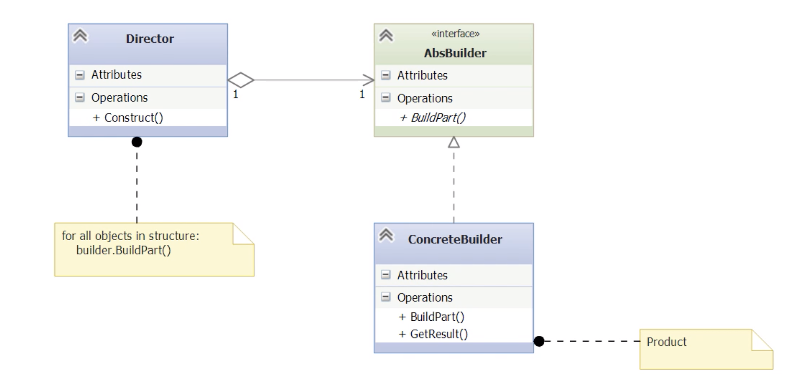

### Builder Pattern

Builder pattern is a creational pattern that means it is used to create objects.
Builder helps by separating the construction of a complex object, say an object 
representing a custom computer from its representation, what the specifications of
the finished computer actually look like. Builder does this by encapsulating the 
construction of the object, thereby obeying the principle encapsulate what varies, 
which is a corollary of single responsibility principle, the S in SOLID. It also
allows for multi step construction process. One key benefit of builder pattern is 
that implementations can vary. The client sees only the abstraction. 

#### Demo: Motivating Example
For our motivating example, let's implement the custom computer builder. A computer
can have many components, and this sort of thing can lead to some bad design choices.

	

  
