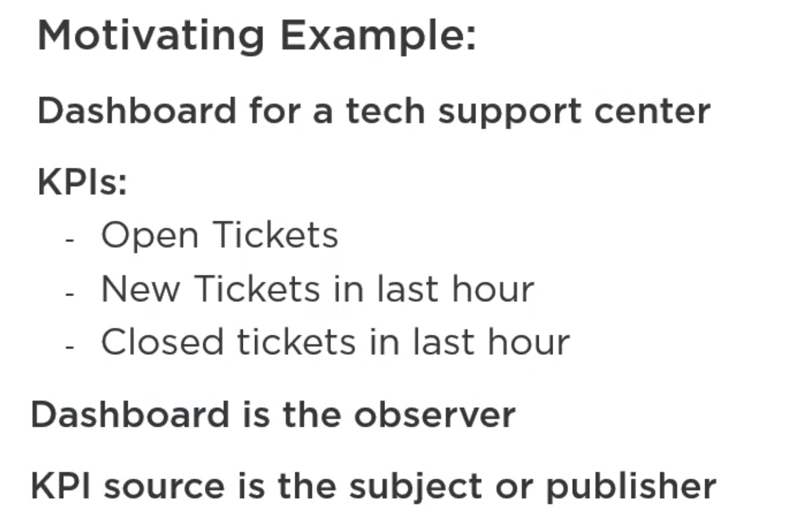
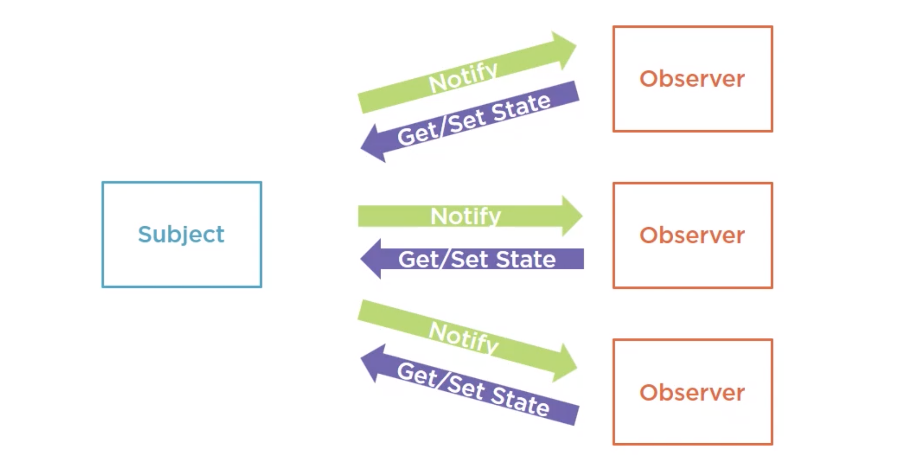
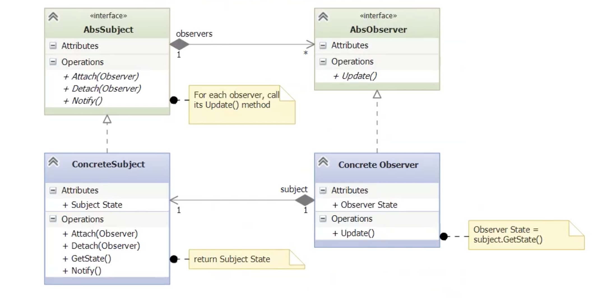

### The Observer Pattern
The observer pattern is a behavioral pattern, so it is used to control the operation of some object. 
The pattern provides a way to define one to many relationships between set of objects, so that 
when state of one object changes, all its dependent objects are notified. 
This pattern is also known as the dependents pattern or Publish Subscribe pattern.
For example, when we subscribe to newspaper or magazine, whenever new edition is published, we'll
receive a copy in the mail. Same idea when we subscribe to a twitter feed or a youtube channel or email list. 

### Example
For our example, consider a dashboard application for technical support center. The dashboard needs to show
Key Performance Indicators or KPIs which includes number of open tickets or issues, new tickets in last hour
and perhaps closed tickets in last hour. In this example dashboard is the observer. KPI source
is the subject or publisher. Other obsevers may be required later, like one showing historical data or 
forecasts using same data. 

        

  

### Observer Design Pattern
The high level design of the observer pattern is straight forward. First there is some subject.
Then there are one or more observers that are interested in changes in the subject. In our example
we have one observer, observing the KPIs. The observer pattern sets up mechanism for observers to
attach to and detach from the subject in order to obtain update notifications. Once a notification 
has been received, each observer has the opportunity to get state information from the subject.
So the subject handles the attached observers and notifications while observers handles updates 
received from the subject. 

        

  

Below is the UML diagram of the observer pattern.
First there is Abstract subject with methods attach, detach and notify
Next we have abstract observer with its one required method update. 
Concrete subject implement the required methods attach, detach and notify
Concrete observer implements the update method. 

        

  

Now when the subject state changes it loops through all currently attached observers
and calls their update() method. 
When called, the observer update() method calls the subject's getState() method to acquire the
changes. In response, the subject returns the state request.

### Summary
In summary, it is a simple way to define one to many relationships between objects
so when one changes, many are notified. Observer pattern is heavily used in many sorts of
application esp. GUIs
