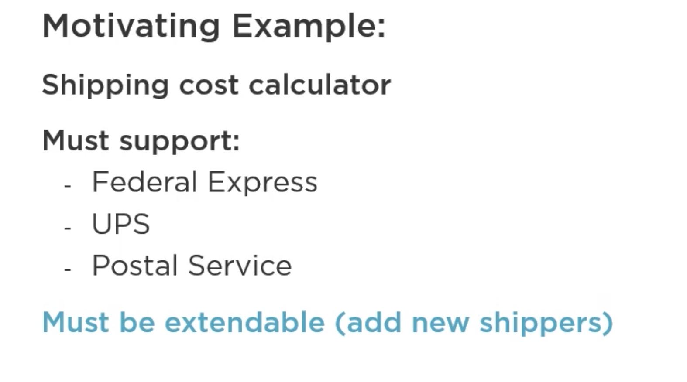
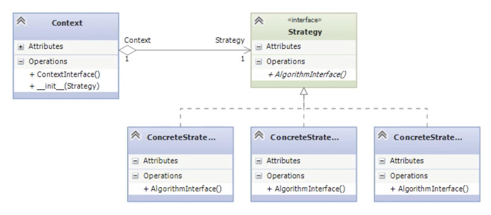

### Strategy Pattern
we’ll be learning about the most used patterns, the Strategy Pattern. It is classified as behavioral pattern, so it is used to control the operation of some object. 
In this case, pattern provides a way to take a family of algorithms, encapsulate each one and make them interchangeable with each other. Since the algorithm form a family, they will normally operate with same set of inputs and outputs, and this is often accomplished by passing in some common object as input as we’ll see in our example. Algorithms are allowed to vary independently. 
We can consider the example of calculating the gravitational attraction using Newton’s formula as opposed to Einstein’s general relativity.
And their implementations can be quite different. Strategy pattern is sometimes called the Policy pattern since it applies some sort of policy to the behaviour of software system. 

	

  
For our example, imagine we are working on a system that processes customer orders. When it’s time to ship the orders, it’s important to calculate the correct shipping cost. For our example, we’ll consider the shipping cost calculator that does just that. 
It must support services from above three services and also whatever we do must be extendable. 

	

  

The UML diagram shows the structure of the strategy pattern. Within some context, we have an interface, which is an abstract base class in Python terms that is common to all the supported algorithms. The context uses this interface to call the various algorithms defined by the concrete strategies that implement the base class. Each concrete strategy implementation takes the same input and returns the same type of output but is free to dictate the algorithm itself. 

### Summary
Strategy pattern is a simple way to encapsulate algorithms and separate them from context where they operate.
